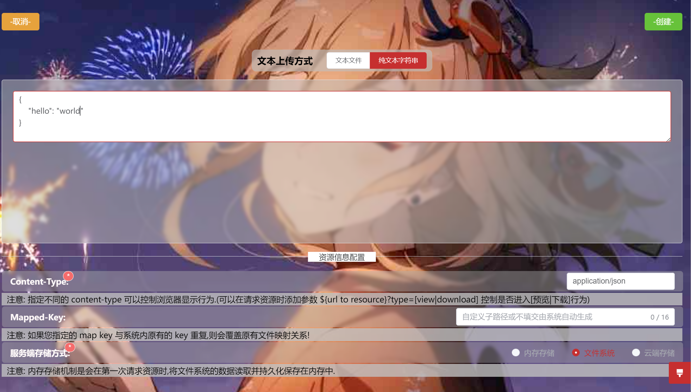

## QuickMapping
> 通过 web ui 快速配置**可用可控**的 HTTP API.  
> 让 web server 构建极简化.

#### 项目主要依赖  
- Spring WebFlux
- log4j2(日志)
- Project Reactor

#### Demo
[部署测试链接](https://lqservice.cn/resource)

- 创建资源
  

- 管理资源
